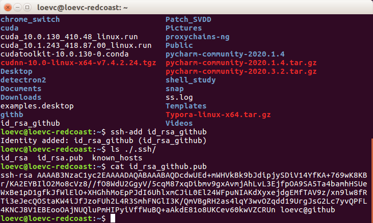
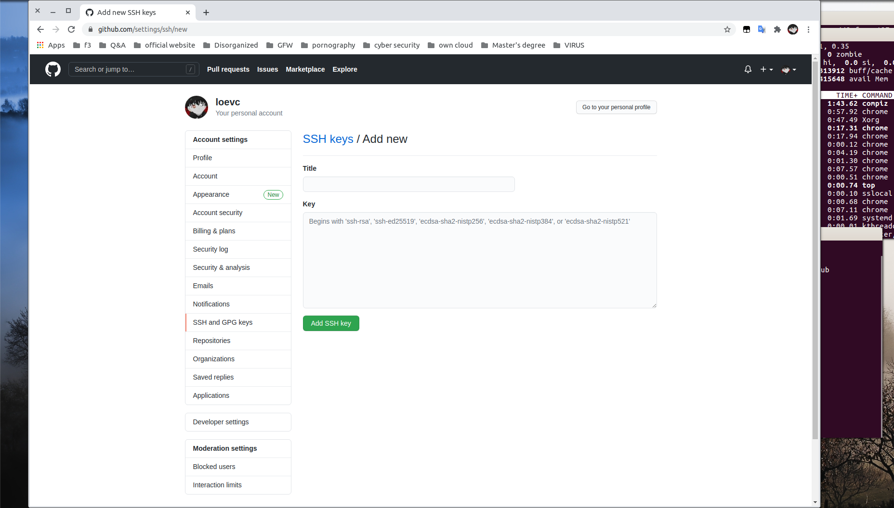

1. generate key 
```
ssh-keygen -C "loevc@github" -t rsa -f id_rsa_github
```


2. add the public key to the github  
```
cat id_rsa_github.pub
```


**copy the public_key to the github's setting ssh .**

3. ssh-add
```
ssh-add id_rsa_github
```


4. identify the tunnel
```
ssh -T git@github.com
```

5. use once passwd then will not again (if you band the ssh)


